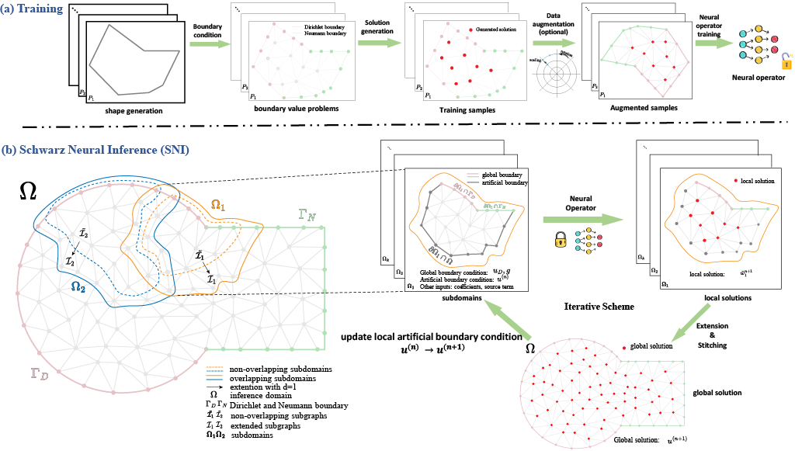
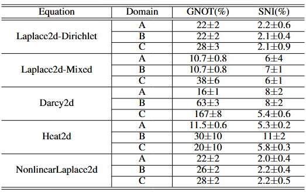

# Operator Learning with Domain Decomposition for Geometry Generalization in PDE Solving

**[ICLR 2026]**  
Code and data for our paper: [Operator Learning with Domain Decomposition for Geometry Generalization in PDE Solving](https://arxiv.org/abs/2504.00510)

---

## Overview

Neural operators often struggle to generalize to new geometries that differ significantly from those seen during training. This limitation restricts their real-world applicability, especially in industrial settings where unseen geometries are common.

**Our solution:** We propose a local-to-global framework that combines operator learning with domain decomposition methods (DDMs) to enable geometry generalization in PDE solving.

<p align="center">
  
</p>

### Framework Components

1. **Training Data Generation**  
   - Generate random basic shapes
   - Impose appropriate boundary conditions
   - Create diverse training data for the neural operator

2. **Local Operator Learning**  
   - Train neural operators on basic shapes
   - Use data augmentation based on PDE symmetries
   - Capture intricate details and variations

3. **Schwarz Neural Inference (SNI)**  
   - Partition the computational domain into subdomains
   - Apply the learned operator locally
   - Iteratively stitch and update the global solution using additive Schwarz methods

---

## Getting Started

*Coming soon: Instructions for setup and usage.*

---

## Data & Data Generation

*Coming soon: Details on data formats and generation scripts.*

---

## Training

*Coming soon: Training procedures and configuration.*

---

## Inference on Unseen Geometries

*Coming soon: How to run inference on new geometries.*

---

## Results

<p align="center">
  
</p>

---

## Citation

If you use this code or data in your research, please cite:

```bibtex
@article{huang2025operator,
  title={Operator Learning with Domain Decomposition for Geometry Generalization in PDE Solving},
  author={Huang, Jianing and Zhang, Kaixuan and Wu, Youjia and Cheng, Ze},
  journal={arXiv preprint arXiv:2504.00510},
  year={2025}
}
```